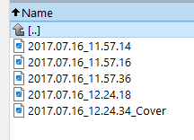

# PhotoPrism

## Cover

Each directory should have one photo with the **_Cover** suffix. This photo will be used by Prism as the album cover.





## Manage the databsae
```bash
docker exec -it homephotoprism-mariadb-1 bash
apt-get update
apt-get install mysql-client
mysql -u root -p

show databases;
use photoprism;
show tables;
```

## Tables in the photoprism database
### Files table

```sql
select id, convert(file_name, char(100)) from files;

--this query takes hash that is needed for the album cover
select convert(file_hash, char(100)) from files;
```

### Photos table

```sql
select convert(photo_path, char(100)), convert(photo_name, char(100)), convert(original_name, char(100)) from photos where convert(photo_name, char(100)) like '%Cover%'

select convert(photo_path, char(100)) from photos
```

### Albums table

```sql
select album_path, album_title,convert(album_order, char(200)), convert(album_type, char(200)), album_type from albums where convert(album_type, char(100))='folder'

select album_path, album_title,convert(album_order, char(200)), convert(album_type, char(200)), album_type from albums where convert(album_type, char(100))='folder' and album_title='2007.05.07 - Wroclaw Z Wujczykami - Odwiedziny'
```


## How to update the album cover
- Copy the filehash of the photo you want to have as cover. 
- You find the hash on the Files tab of the edit dialog (https://docs.photoprism.app/user-guide/organize/edit/#edit-files)
- In the albums table set the filehash as "thumb"
- Set "thumb_src" to "manual" so that your changes do not get ove alwritten


## Updating the cover with SQL

```sql
--- query selects all important data
select a.album_path
,convert(a.album_type, char(200))
,a.album_type
,p.id
,convert(p.photo_name, char(200)) 
,convert(f.file_hash, char(200))
from albums a 
inner join photos p on a.album_path=p.photo_path 
inner join files f on p.id=f.photo_id
where convert(album_type, char(100))='folder' 
--and album_title='2007.05.07 - Wroclaw Z Wujczykami - Odwiedziny'
and convert(p.photo_name, char(200)) like '%Cover%';

--- query updates the cover, and changes the order to name
update albums a 
inner join photos p on a.album_path=p.photo_path 
inner join files f on p.id=f.photo_id
set thumb=convert(f.file_hash, char(200)),thumb_src='manual', album_order='name'
where convert(album_type, char(100))='folder' 
and convert(p.photo_name, char(200)) like '%Cover%';
```

### Debug queries

```
select thumb,convert(thumb,char(100)), thumb_src,convert(thumb_src, char(200)) from albums where album_title='2007.05.07 - Wroclaw Z Wujczykami - Odwiedziny';

update albums set thumb='870f69d6c6f3f0ad9232b195585099a3fb87828b', thumb_src='manual' where album_title='2007.05.07 - Wroclaw Z Wujczykami - Odwiedziny';
```

Select Covers from all directories
```
select a.album_path ,convert(a.album_type, char(200)) ,a.album_type ,p.id ,convert(p.photo_name, char(200))  ,convert(f.file_hash, char(200)) from albums a  inner join photos p on a.album_path=p.photo_path  inner join files f on p.id=f.photo_id where convert(album_type, char(100))='folder' and convert(p.photo_name, char(200)) like '%Cover%';
```

## Updating the categories for albums

```sql
update albums set album_category=substring_index(album_path,"#",-1)  where album_path <> "" and position("#" in album_path)>0;
```

## Set cron script on the docker to update the cover
- Copy file to docker
```
 docker cp UpdateDB.sh 4200471e7c42:\UpdateDB.sh
docker cp Prism.env 4200471e7c42:\Prism.env
```
- On the docker instance set the env variable
```
export ENV_PHOTOPRISM_DATABASE_PASSWORD=
```

Debug:
source /home/pawel/github/Home.Configuration/Prism.env
echo $ENV_PHOTOPRISM_DATABASE_PASSWORD

chmod u+x hello_world.sh


### Set crontab

```
apt-get update && apt-get install -y cron
apt-get update && apt-get install -y nano

crontab -e
*/5 * * * * /UpdateDB.sh
```


## docker deploy

To deploy the application, copy the environments from configuration 

- copy_envs.sh

```
chmod +x copy_envs.sh
```
